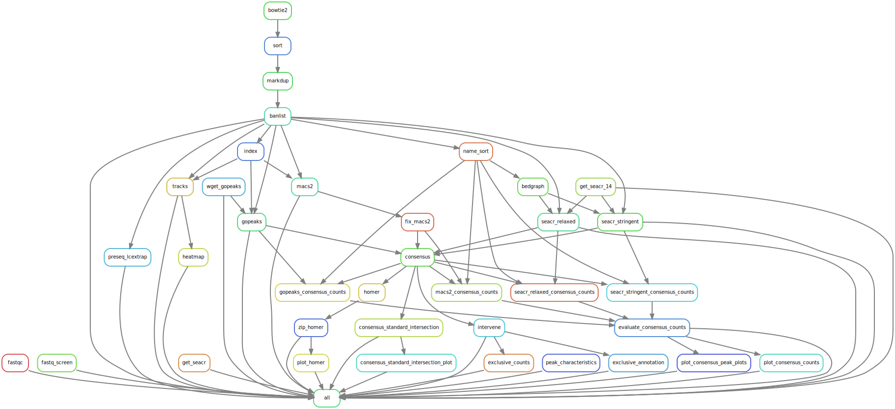

# gopeaks-compare

[CUT&TAG](https://www.nature.com/articles/s41467-019-09982-5) and [CUT&RUN](https://elifesciences.org/articles/21856) are new molecular biology techniques that can find the locality of histone marks and transcription factor in DNA. Unlike the well-established ChIP-Seq protocol, CUT&TAG generates data with very little background signal, enriched peaks, and requires **10-fold** less sequencing reads per sample. Due to the increased sparsity of signal in CUT&TAG, contemporary peak calling software like MACS2 and SEACR can have trouble identifying regions of histone / transcription factor enrichment in the genome; this problem is compounded by using lower-than-ideal quality sequencing libraries.

## Workflow

This repository compares the performance of gopeaks with MACS2 and SEACR in CUT&TAG / CUT&RUN data. The code for this analysis was adapted from the original [CUT&TAG pipeline](https://github.com/maxsonBraunLab/cutTag-pipeline), with additional steps for MACS2 and SEACR peak calling. The additional steps will also include taking high-confidence peaks across biological replicates, plot the quality of peaks for each method, and evaluate the completeness of a method's peak call against a gold standard using ROC curves. A complete write-up of the methods can be found in the official paper **here**.

## Results

Once all the public data has been downloaded with `src/custom/data_download.sh` and the pipeline is finished, all the results will be found in `data/figures`. More results to come once the paper goes up!

## References

Thank you to those who have contributed their time and effort to push the boundaries of progress.

## Method

**CUT&TAG**

Kaya-Okur, H.S., Wu, S.J., Codomo, C.A. *et al.* CUT&Tag for efficient epigenomic profiling of small samples and single cells. *Nat Commun* **10,** 1930 (2019). https://doi.org/10.1038/s41467-019-09982-5

**CUT&RUN**

eLife 2017;6:e21856      doi: [10.7554/eLife.21856](https://doi.org/10.7554/eLife.21856)

**SEACR**

Meers, M.P., Tenenbaum, D. & Henikoff, S. Peak calling by Sparse Enrichment Analysis for CUT&RUN chromatin profiling. *Epigenetics & Chromatin* **12,** 42 (2019). https://doi.org/10.1186/s13072-019-0287-4

**MACS2**

Zhang, Y., Liu, T., Meyer, C.A. *et al.* Model-based Analysis of ChIP-Seq (MACS). *Genome Biol* **9,** R137 (2008). https://doi.org/10.1186/gb-2008-9-9-r137

